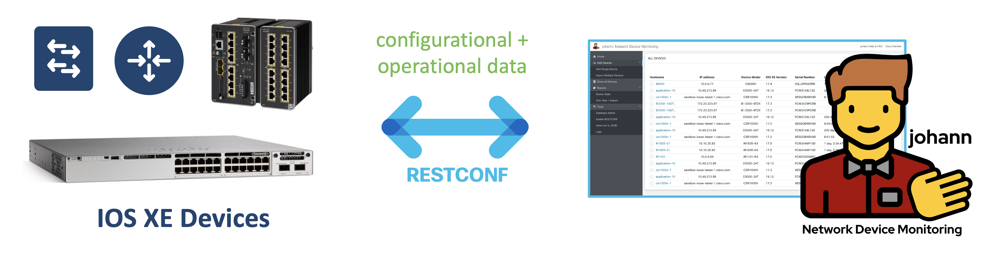
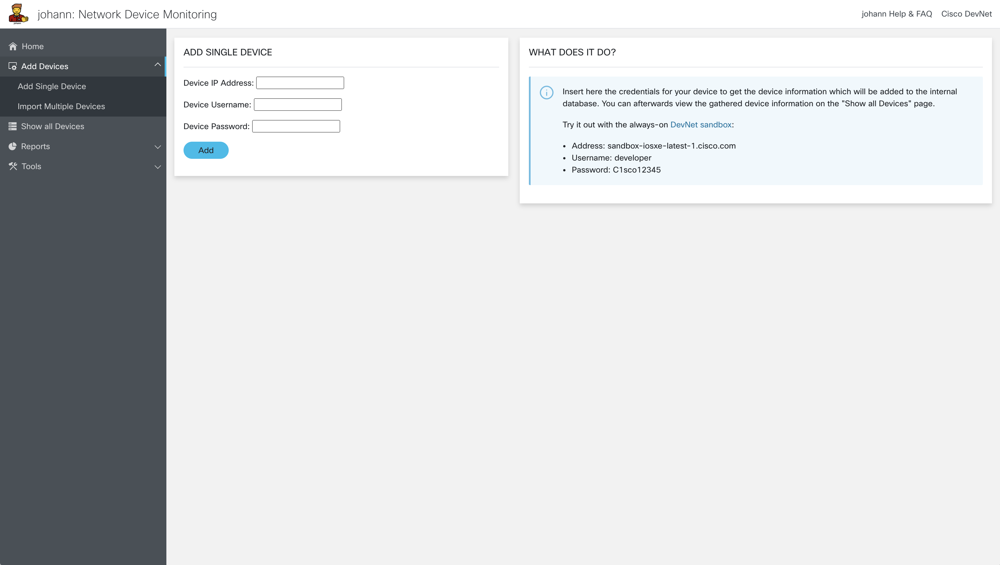
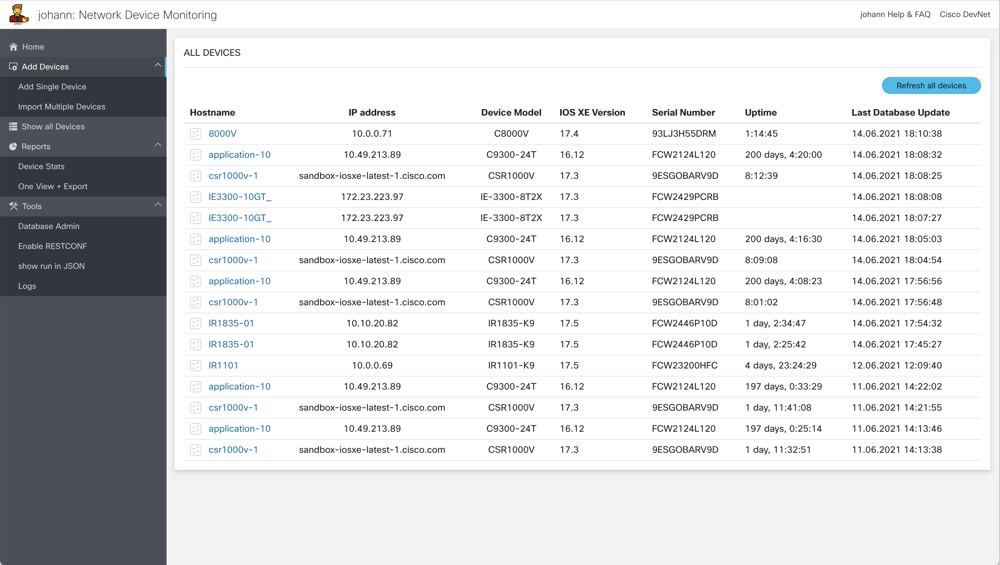
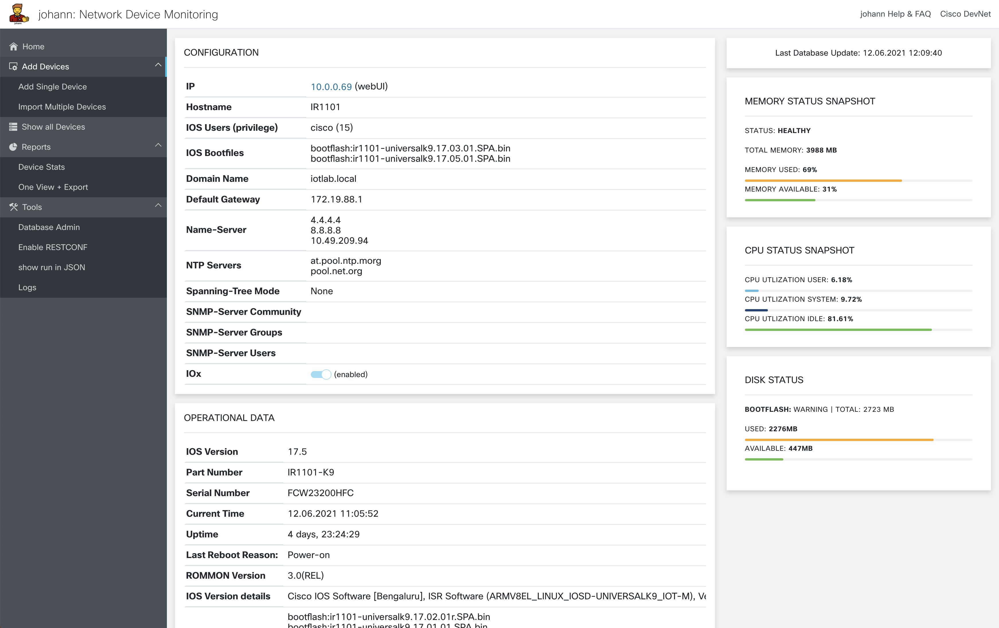
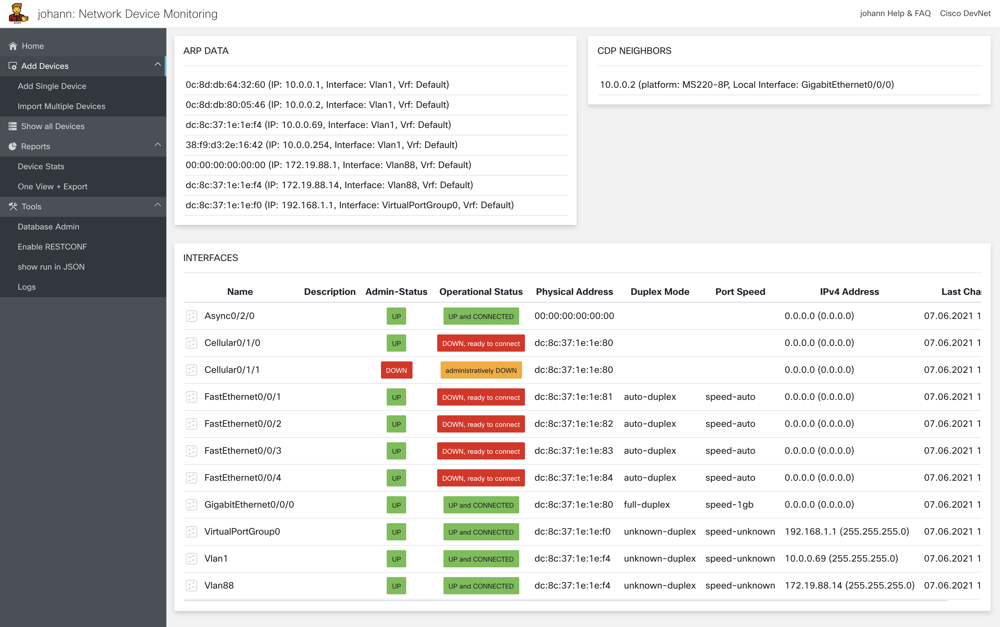
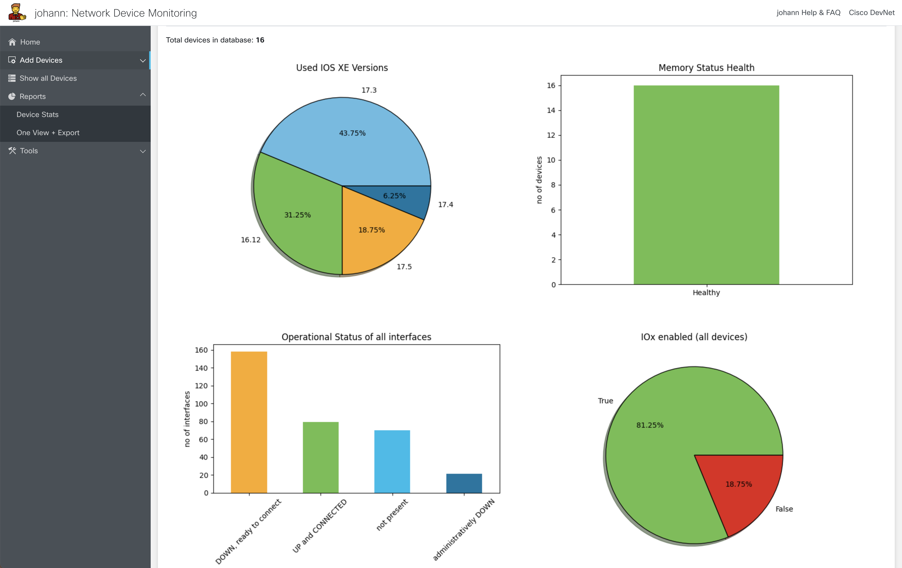
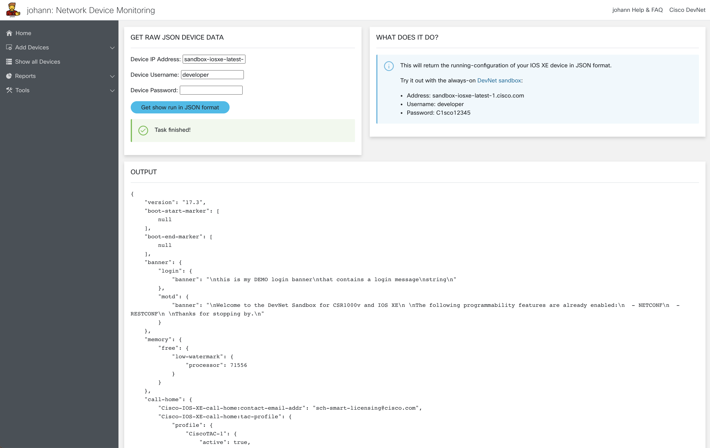
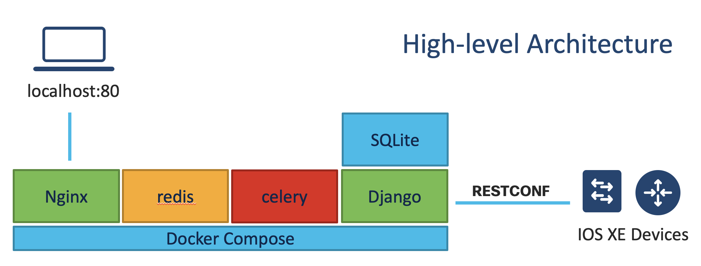
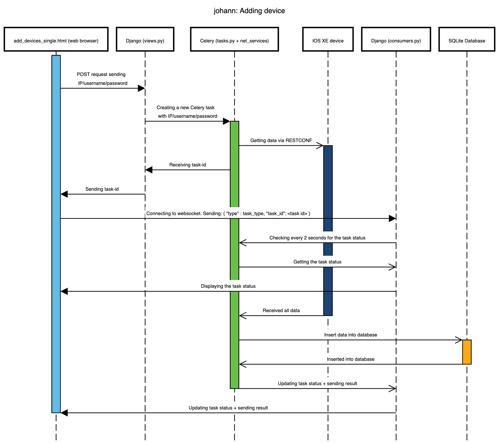

<div align="center">
  
</div>
<p align="center">
  <a href="https://developer.cisco.com/codeexchange/github/repo/flopach/johann-network-device-monitoring">
    
  </a>
</p>

**johann** is a web-based network device monitoring tool for **Cisco IOS XE devices**. Collect configuration and operational data of your networking devices in a structured way in one single database!

**Get an Overview in this [YouTube Video](https://youtu.be/qsJvul6yLBE)!**



## Features

* Add single or multiple devices (.csv file) at once to the johann SQLite database
* Show device information on a structured web-dashboard
* Update all device information
* Show simple report graphs
* Export database as .xlsx
* Toolset:
	* Enable RESTCONF on a single IOS XE device
	* Test RESTCONF: Get current configuration in JSON format
	* Show logs

### Supported Devices*

* ASR 1000
* ASR 900 RSP2/RSP3, ASR 920, NCS 520 and NCS 4200
* Catalyst 9200,9300,9400,9500,9600,9800
* Catalyst 8000V
* CSR 1000v
* ESS 3x00
* IR 1101
* IE 3x00
* ISR 1000
* ISR 4000

_*RESTCONF needs to be supported in the IOS XE version!_

## Installation

johann is easy installable:

1. Install Docker Engine and [Docker Compose](https://docs.docker.com/compose/install/)

2. Then copy & paste into terminal (on Linux you may need to start Docker with a non-root user):

```
git clone https://github.com/flopach/johann-network-device-monitoring &&
cd johann-network-device-monitoring/docker/ &&
docker-compose up
```

After all containers are up, you can access the web-dashboard via [http://localhost](http://localhost).

## Demo GIF


*(size: 11MB)*

## Screenshots

| | | |
|:-------------------------:|:-------------------------:|:-------------------------:|
| |   |  |
|  |   | |

## FAQs

**Are only IOS XE devices supported?** - For now, yes only IOS XE devices.

**What YANG modules do you use?** - Cisco IOS-XE native YANG models only.

**johann does not get _______ operational/configuration data!** - Feel free to add it or send a feature request.

**Why is some information empty in the johann database?** - The RESTCONF interface of the device did not provide this information.

**What is the password for Database admin?** - You can set the Django superuser in the ./docker/johann/Dockerfile. The default is admin/admin123 to acess the database.

**johann does not support ______ !** - Please put in a feature request of feel free to add this feature!

**When stopping Docker, what data will be saved? And where?** - The whole SQLite database and .log file will be saved in `docker/johann/stickydata/`.

## Known Limitations

* Currently, only timezone UTC is supported
* Devices can only be deleted via Django Database Manager 
* Passwords are not encrypted in the database 

## Technical Deep-Dive

**High-level architecture**



**Sequence diagram for adding devices**



## Built With

* Django + Django Channels
* Redis
* [Cisco UI Kit](https://developer.cisco.com/site/uiux/)
* jQuery
* Featured Python Libraries: Requests, Netmiko (just for enabling RESTCONF), Matplotlib

## Versioning

**0.1.0** - Initial Release

## Authors

* **Florian Pachinger** - *Initial work* - [flopach](https://github.com/flopach)

## License

This project is licensed under the Cisco Sample Code License 1.1 - see the [LICENSE.md](LICENSE.md) file for details

## Further Links

* [Cisco DevNet Website](https://developer.cisco.com)
* [YouTube Video](https://youtu.be/qsJvul6yLBE)
